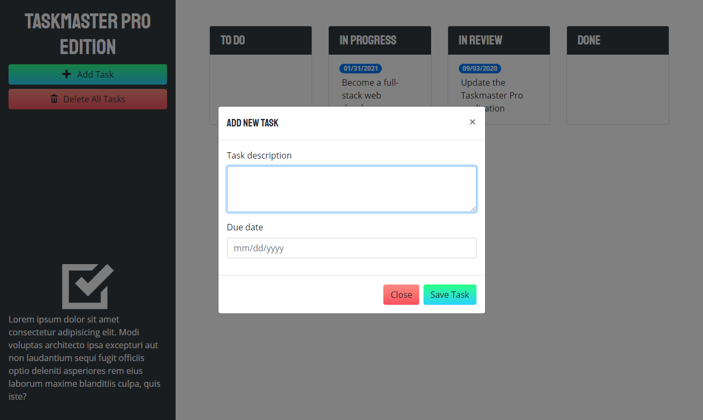
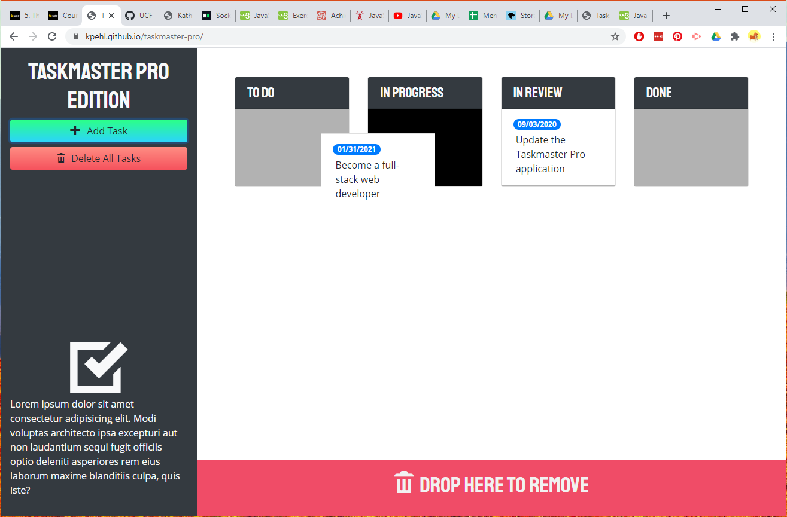

# Taskmaster Pro

## Page Description
This page is a functional task tracking application in a Kanban board style. APIs are used to enable functions and to provide custom fonts and icons.  This was modified from a base code provided as a project for a coding bootcamp.  The module focused on introducing jQuery, jQUeryUI, moment, Google Fonts, and Open Iconic as tools to build a web application. Responsive design is emphasized.  

## Page Link
This page is hosted at https://kpehl.github.io/taskmaster-pro/

## Tools used
HTML
CSS
JavaScript
jQuery
jQueryUI
moment

## Screenshot

